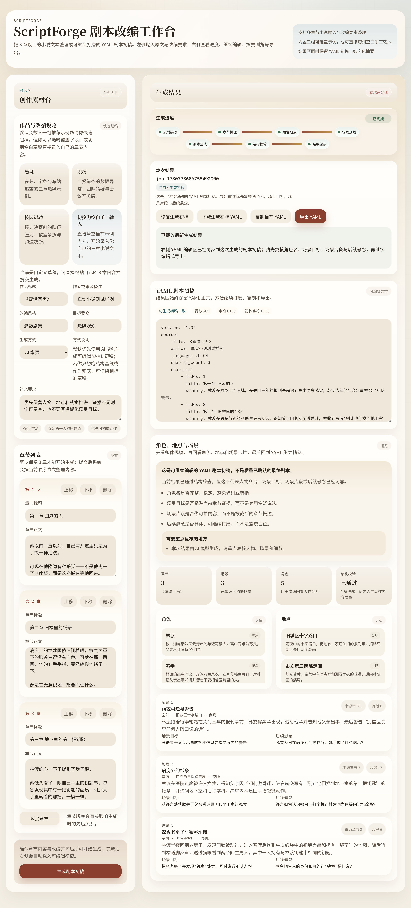

# ScriptForge

Turn a real 3-chapter novel into an editable screenplay YAML draft through a job-based Go pipeline and a lightweight review workspace.

## Demo video:

ScriptForge-轻量易用的小说转yaml剧本 AI工具: https://www.bilibili.com/video/BV1LHEb64E6s

## Judge Snapshot

ScriptForge is a 72-hour MVP for the contest prompt "AI 小说转剧本工具".

It is not a single chat box. The current deliverable already includes:
- manual 3-chapter novel input
- async job creation and polling
- `llm-first` YAML screenplay generation
- schema validation plus scene-level `evidence` / `review`
- frontend YAML viewing, editing, and export

## Real Sample

Primary real-input regression sample:
- source text: [`test/da-feng-da-geng-ren.md`](test/da-feng-da-geng-ren.md)
- input path: switch to blank manual input, then paste the real 3 chapters from that file
- real run mode: `generation.mode=llm`
- current observed output shape: a completed result page with editable YAML draft, scene cards, character/location summary, and export actions in the same workspace

Real workspace capture from the current local app, using manual input for the real `《大奉打更人》` sample above and showing the completed result state rather than a short canned preset:



Public internet deployment is not currently treated as a hard requirement for this contest. The latest organizer brief requires a publicly accessible repository, a demo video, and a clear README; deployment style is unrestricted. This repo therefore prioritizes reproducible local startup plus demo clarity first, with public hosting remaining optional.

## 3-Step Local Run

1. Prepare provider config:

```bash
cp .env.local.example .env.local
```

Fill the real provider key in `.env.local`.
Also fill the concrete model name in `.env.local`. Recommended provider setup for this repo: DeepSeek API via the OpenAI-compatible endpoint.

2. Start the backend:

```bash
cd backend
go run ./cmd/api
```

3. Start the frontend:

```bash
cd frontend
npm install
npm run dev
```

Then open `http://127.0.0.1:5173`, switch to blank manual input if needed, paste your own 3 chapters, and generate the YAML draft.

## Why This Repo Is Competitive

- The output contract is structured YAML, not an untraceable free-form answer.
- The backend is a staged Go pipeline with job persistence, validation, export, and provider debug artifacts.
- The frontend is intentionally lightweight, but the full user path is already runnable: input -> progress -> YAML -> edit -> export.
- The repo is document-first, with scope, decisions, progress, API contract, pipeline contract, and demo guidance all checked into `docs/`.

## Key Links

- [Documentation Index](docs/README.md)
- [YAML Schema and design rationale](docs/yaml-schema.md)
- [Competition brief and judging implications](docs/competition-brief.md)
- [Frontend demo recording guide](docs/demo-recording-guide.md)

This repository is being initialized for a 72-hour training-camp project. The implementation baseline is document-first: product scope, architecture decisions, progress tracking, PR rules, and handoff context live under [`docs/`](docs/README.md).

Read in this order before making changes:
1. [`docs/final-solution.md`](docs/final-solution.md)
2. [`docs/implementation-progress.md`](docs/implementation-progress.md)
3. [`docs/backend-architecture.md`](docs/backend-architecture.md)
4. [`docs/backend-tech-stack.md`](docs/backend-tech-stack.md)
5. [`docs/api-contract.md`](docs/api-contract.md)
6. [`docs/backend-pipeline.md`](docs/backend-pipeline.md)
7. [`docs/frontend.md`](docs/frontend.md)
8. [`docs/yaml-schema.md`](docs/yaml-schema.md)
9. [`docs/architecture-self-check.md`](docs/architecture-self-check.md)
10. [`docs/collaboration-rules.md`](docs/collaboration-rules.md)

## Current State

- Documentation baseline: ready and executable
- Backend implementation: job API, YAML export path, and `llm` provider path are runnable
- Goal: keep future human/agent sessions aligned to the same scope and judging constraints
- Important correction: the intended product direction is now `llm-first`; `deterministic` remains available only as fallback / smoke baseline and should not keep expanding as the main generation strategy

## Current Runnable Ability

- `backend/` exposes `POST /api/v1/jobs`
- background job pipeline persists job status and YAML artifacts
- `GET /api/v1/jobs/:id`, `GET /api/v1/jobs/:id/result`, and `GET /api/v1/jobs/:id/export` are available
- `frontend/` now runs a Vite + React + TypeScript editorial workspace with real manual multi-chapter input, job polling, YAML result loading, structured summary, and export actions
- failed jobs can be regenerated from the current frontend form without adding a separate retry API
- frontend sample presets now cover suspense, workplace, and campus relay source scenarios
- the quick-start area now uses a 2x2 preset card grid, including an explicit blank-manual-input entry instead of a separate side button
- the workspace copy is now author-facing; demo narration and walkthrough notes live in `docs/demo-recording-guide.md` instead of the product page
- the workspace now exposes explicit idle/loading/succeeded/failed copy and remains readable across desktop, tablet, and mobile layouts
- the result workspace now distinguishes backend-original vs local-edited YAML, supports copy/reset/export feedback, and adds screenplay overview cards from backend JSON
- the current frontend visual language is fully rounded and color-block driven; most hierarchy is now expressed by container tone and spacing instead of nested borders
- `generation.mode=llm` now supports `mock` and `openai_compatible` providers behind the same job API
- the `openai_compatible` path has been validated against DeepSeek-compatible `/chat/completions` and normalizes loose provider YAML into the canonical project schema
- malformed `openai_compatible` YAML now gets up to 3 provider attempts before the pipeline falls back to deterministic
- fallback runs now preserve provider debug artifacts so malformed upstream output can be inspected after the job completes
- fixture-backed integration tests cover create, status, result, export, invalid input, not-ready, and llm mock behavior

## Frontend Smoke-Check

```bash
cd frontend
npm run smoke:workspace
```

## Default Local Demo Ports

- backend API: `http://127.0.0.1:8080`
- frontend dev server: `http://127.0.0.1:5173`
- Vite dev proxy forwards `/api/*` to `http://127.0.0.1:8080` by default

## Recommended Local Startup

1. Start the backend from the repo root or `backend/`; the default `HTTP_ADDR` is `:8080`.
2. Start the frontend with `npm run dev`; Vite serves the workspace on `:5173`.
3. Open `http://127.0.0.1:5173`; frontend requests to `/api/v1/*` are proxied to the backend automatically.

## Demo Walkthrough Note

- Use [docs/demo-recording-guide.md](docs/demo-recording-guide.md) for presenter-facing narration, sample order, and recording flow. The product page itself stays focused on author use rather than judge instructions.

## Frontend Real-Chain Self-Check

1. Start the backend on `http://127.0.0.1:8080` and the frontend on `http://127.0.0.1:5173`.
2. Open the workspace; the recommended `职场` sample is loaded only for quick start, but the primary acceptance path is still `切换为空白手工输入` and pasting your own 3 chapters.
3. Keep `generationMode=llm` as the corrected target default for the main path; if local provider credentials are unavailable, use `deterministic` only as a temporary fallback for smoke/debug instead of treating it as the long-term main strategy.
4. Watch the progress strip at the top of the result workspace until polling moves the job from `queued/running` to `succeeded`.
5. Confirm the right-side result area loads real backend data: progress state, YAML text, structured screenplay summary, and export actions.
6. Use the export actions to verify both `下载生成初稿 YAML` and `导出 YAML` paths.
7. Optional fallback-path check: switch the form to `generationMode=llm` while the backend runs with `LLM_PROVIDER=disabled`, submit once, confirm the job still succeeds with explicit fallback warnings, then click `重新生成当前内容` to verify the frontend creates a fresh job from the same form state.
8. Narrow the viewport to a tablet or mobile width and confirm the workspace collapses into a readable `Input -> Result` vertical flow, with generation progress kept inside the result area.
9. After a successful result load, modify the YAML once, confirm the toolbar flips from `当前为生成初稿` to `当前为本地编辑稿`, then test `复制当前 YAML` and `恢复生成初稿`.
10. Run one extra non-preset pass: click `切换为空白手工输入`, enter your own 3 chapters, then repeat `create job -> polling -> YAML/result/export` to confirm the main path does not depend on built-in samples.

## Scripted Frontend Smoke-Check

- `npm run smoke:workspace` expects the backend on `:8080`, the frontend dev server on `:5173`, and a local Chrome or Edge executable.
- It verifies two real frontend acceptance paths: a sample preset run and a non-preset manual 3-chapter run, both covering real `POST /api/v1/jobs`, polling, YAML load, structured summary, export, local edit, `复制当前 YAML`, disabled-provider fallback regenerate, `lastJobId` refresh restore, and mobile `Input -> Result` panel order.
- Do not treat the sample preset path as the main product proof. Real manual 3-chapter input is the primary acceptance path for this project.
- The disabled-provider regenerate branch is a hard requirement of this smoke-check and expects the backend to run with `LLM_PROVIDER=disabled`; the current product contract is explicit `llm -> deterministic` fallback with warnings rather than a hard failed job.
- Optional overrides:
  - `FRONTEND_SMOKE_UI_URL`
  - `FRONTEND_SMOKE_BACKEND_HEALTH_URL`
  - `FRONTEND_SMOKE_SAMPLE_LABEL`
  - `FRONTEND_SMOKE_CHROME_PATH`
  - `FRONTEND_SMOKE_TIMEOUT_MS`

## Frontend API Note

```bash
# bash / zsh: optional when frontend and backend are on different origins
export VITE_API_BASE_URL=http://localhost:8080/api/v1

# bash / zsh: optional when the backend is not on the default local port
export VITE_API_PROXY_TARGET=http://127.0.0.1:8080
```

## Local / Deployment Prerequisite For Real Provider Runs

```bash
cp .env.local.example .env.local
# edit .env.local and fill your real key
set -a && source .env.local && set +a
```

`backend/internal/config` now auto-discovers a repo-root `.env.local` when you run `cd backend && go run ./cmd/api`, so the manual `source` step is optional for local backend-only runs and still useful when you want the same variables in your current shell session.

## Backend Quick Start With A Local External Provider

```bash
cd backend
go run ./cmd/api
```

## LLM Mode Options

```bash
# local verification without external network
export LLM_PROVIDER=mock

# vendor-neutral external provider wiring
export LLM_PROVIDER=openai_compatible
export LLM_BASE_URL=https://your-provider.example/v1
export LLM_MODEL=your-model-name
export LLM_API_KEY=your-api-key
```

## Local Secret Handling

- keep provider credentials in a repo-root `.env.local`
- `.env.local` is gitignored and must never be committed
- start from `.env.local.example` so other human/agent sessions inherit the same expected variable names
- `openai_compatible` has been validated with DeepSeek using `deepseek-v4-flash` as the current low-cost chain-test model
- DeepSeek official docs currently list the OpenAI-format base URL as `https://api.deepseek.com`, `/chat/completions` as the chat endpoint, and `deepseek-v4-flash` / `deepseek-v4-pro` as the active model IDs
- reference docs:
  - [DeepSeek Create Chat Completion](https://api-docs.deepseek.com/api/create-chat-completion)
  - [DeepSeek Models & Pricing](https://api-docs.deepseek.com/quick_start/pricing)
  - [DeepSeek JSON Output](https://api-docs.deepseek.com/guides/json_mode)

## OpenAI-Compatible Provider Note

- keep `LLM_PROVIDER=openai_compatible`
- swap only `LLM_BASE_URL`, `LLM_MODEL`, and `LLM_API_KEY` when moving from DeepSeek to another compatible provider
- the current backend path remains YAML-first because the project output contract is YAML, even though DeepSeek also documents JSON Output support

## Current Backend Focus

- correct the project back to an `llm-first` generation direction
- keep deterministic only as fallback / smoke baseline instead of growing it into a rule-heavy adaptation engine
- continue polishing provider prompt, normalization, and validation honesty while keeping the YAML-first output contract
- keep real manual Chinese 3-chapter inputs as the main acceptance target, with fixtures only as regression support

## Backend Self-Check

```bash
cd backend
GOCACHE=/tmp/scriptforge-gocache go test ./...
GOCACHE=/tmp/scriptforge-gocache go build -o /tmp/scriptforge-api ./cmd/api
```

## Backend Acceptance Note

- run backend self-checks from `backend/`; the repo root is not a Go module root
- keep YAML fixture regressions, but do not treat fixtures as the only acceptance target
- at least one regression should cover a custom Chinese 3-chapter input through the real job pipeline rather than only comparing canned fixtures
- if a custom real input produces structurally valid but semantically weak YAML, treat that as a product blocker rather than a tolerable fixture gap

## Backend Smoke-Check

```bash
# deterministic local path
scripts/run_backend_smoke.sh deterministic

# real provider path (requires .env.local)
scripts/run_backend_smoke.sh llm

# pick a specific demo fixture
scripts/run_backend_smoke.sh deterministic family
scripts/run_backend_smoke.sh deterministic comedy
```

## Example Fixture Inputs

- [`testdata/novels/night-rain-request.json`](testdata/novels/night-rain-request.json)
- [`testdata/novels/workplace-crisis-request.json`](testdata/novels/workplace-crisis-request.json)
- [`testdata/novels/campus-relay-request.json`](testdata/novels/campus-relay-request.json)
- [`testdata/novels/family-dinner-request.json`](testdata/novels/family-dinner-request.json)
- [`testdata/novels/comedy-live-mixup-request.json`](testdata/novels/comedy-live-mixup-request.json)

## Example Expected Outputs

- [`testdata/expected/night-rain.screenplay.yaml`](testdata/expected/night-rain.screenplay.yaml)
- [`testdata/expected/workplace-crisis.screenplay.yaml`](testdata/expected/workplace-crisis.screenplay.yaml)
- [`testdata/expected/campus-relay.screenplay.yaml`](testdata/expected/campus-relay.screenplay.yaml)
- [`testdata/expected/family-dinner.screenplay.yaml`](testdata/expected/family-dinner.screenplay.yaml)
- [`testdata/expected/comedy-live-mixup.screenplay.yaml`](testdata/expected/comedy-live-mixup.screenplay.yaml)

## Initial Repository Layout

```text
docs/
.github/
backend/
frontend/
scripts/
testdata/
deploy/
```

## Handoff

Use [`docs/README.md`](docs/README.md) as the main handoff and intake index.
